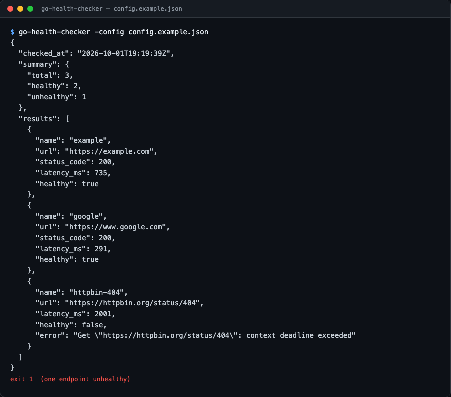
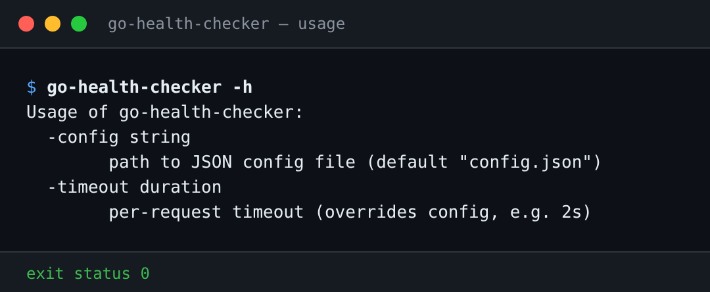
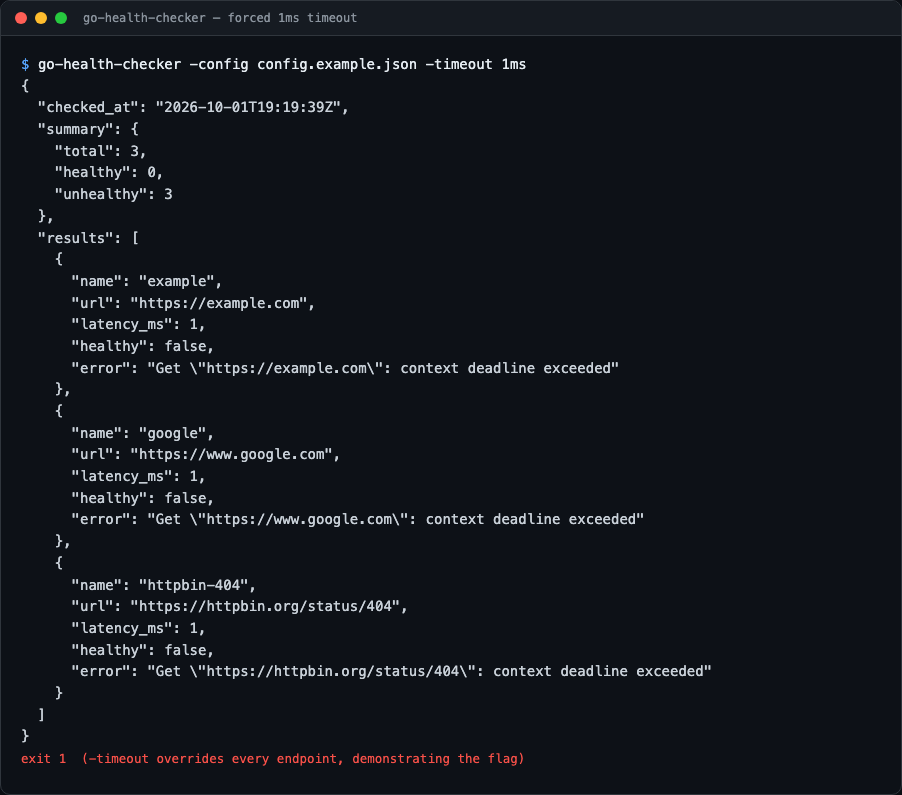
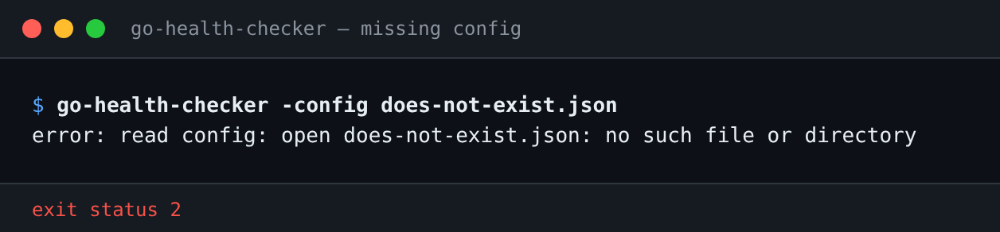
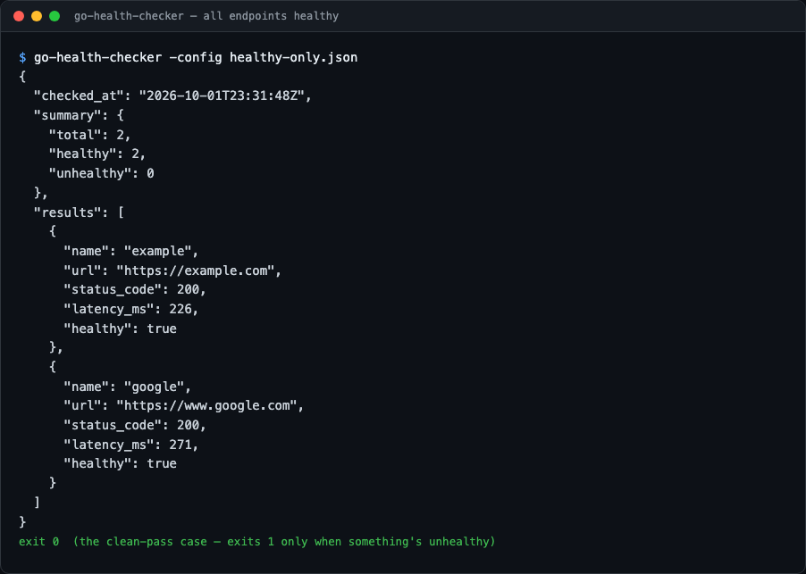

# go-health-checker

A small CLI tool that probes a list of HTTP endpoints defined in a JSON config
file and prints a JSON report with each endpoint's status code, latency, and
health. Exits non-zero when any endpoint is unhealthy, so it drops cleanly into
CI pipelines and cron jobs.

## Preview

Real output from running the binary (not mocked). Each image is generated by
[`scripts/gen_screenshots.py`](scripts/gen_screenshots.py), which runs the exact
command shown against a local demo server (configs in [`docs/demo/`](docs/demo/))
and renders the captured output and exit status. A plain-text transcript sits
next to each image in `docs/screenshots/`.



<details>
<summary>More views</summary>









</details>

## Features

- Concurrent checks — all endpoints are probed in parallel, results stay in config order
- Latency measurement per endpoint (milliseconds)
- Health classification: 2xx/3xx = healthy, anything else (4xx/5xx, connection errors, timeouts) = unhealthy.
  Redirects are followed (Go's default, up to 10), so the final response's status is what counts
- Aggregated summary (total / healthy / unhealthy)
- Exit codes: `0` all healthy, `1` at least one unhealthy, `2` config/usage error
- Zero external dependencies — Go standard library only

## Tech stack

- Go (1.22+), standard library only: `net/http`, `encoding/json`, `sync`, `flag`
- Tests use `net/http/httptest` — no network access required

## Architecture

```
.
├── main.go                  # CLI entry point: flags, config loading, JSON output, exit code
├── main_test.go             # End-to-end tests: builds the binary, asserts exit codes
├── checker/
│   ├── config.go            # Config struct, JSON parsing, validation
│   ├── checker.go           # Concurrent probing + Report/Summary types
│   └── checker_test.go      # Unit tests (httptest servers, table-driven config tests)
├── config.example.json      # Sample configuration
├── docs/
│   ├── demo/                # Configs used to generate the screenshots
│   └── screenshots/         # README images + text transcripts
├── scripts/
│   └── gen_screenshots.py   # Regenerates docs/screenshots from real runs
├── .github/workflows/ci.yml # gofmt, go vet, go test -race on Go 1.22 and stable
└── go.mod
```

The `main` package is a thin shell: it parses flags, loads the config via
`checker.LoadConfig`, runs `Checker.CheckAll`, marshals the resulting `Report`
as indented JSON, and maps the summary to an exit code. All logic lives in the
`checker` package so it is independently testable and reusable as a library.

`CheckAll` launches one goroutine per endpoint and waits with a
`sync.WaitGroup`; each goroutine writes to its own pre-indexed slot in the
results slice, so output order matches the config and no mutex is needed.

## Setup

Requires Go 1.22 or newer.

```sh
git clone https://github.com/tenalisriharsha/go-health-checker.git
cd go-health-checker
go build -o go-health-checker .
```

## Usage

```sh
# Use the sample config
cp config.example.json config.json
./go-health-checker -config config.json

# Override the per-request timeout from the CLI
./go-health-checker -config config.json -timeout 1s
```

### Config format

```json
{
  "timeout_ms": 2000,
  "endpoints": [
    { "name": "example", "url": "https://example.com" },
    { "name": "api", "url": "https://api.example.com/health" }
  ]
}
```

- `timeout_ms` — optional per-request timeout (default: 5000 ms; overridden by `-timeout`)
- `endpoints` — required, non-empty; each entry needs a `name` and an absolute `http(s)` URL

### Example output

Output of `go-health-checker -config sample.json` (from `docs/demo/`, see
[`01-sample-run.txt`](docs/screenshots/01-sample-run.txt)); exit status 1:

```json
{
  "checked_at": "2026-10-08T18:09:57Z",
  "summary": {
    "total": 3,
    "healthy": 2,
    "unhealthy": 1
  },
  "results": [
    {
      "name": "local-ok",
      "url": "http://127.0.0.1:8765/",
      "status_code": 200,
      "latency_ms": 52,
      "healthy": true
    },
    {
      "name": "local-redirect",
      "url": "http://127.0.0.1:8765/old",
      "status_code": 200,
      "latency_ms": 104,
      "healthy": true
    },
    {
      "name": "local-missing",
      "url": "http://127.0.0.1:8765/nope",
      "status_code": 404,
      "latency_ms": 52,
      "healthy": false,
      "error": "unexpected status 404"
    }
  ]
}
```

### Exit codes

| Code | Meaning                        |
| ---- | ------------------------------ |
| 0    | All endpoints healthy          |
| 1    | At least one endpoint unhealthy |
| 2    | Config file error / bad usage (unknown flag, stray argument, negative `-timeout`) |

## Running tests

```sh
go test ./... -v
```

The suite covers config parsing and validation (table-driven), healthy/redirect/
error/timeout/refused-connection probing against local `httptest` servers,
result ordering, summary aggregation, and a concurrency sanity check.
`main_test.go` builds the binary and checks the documented exit codes end to end.
